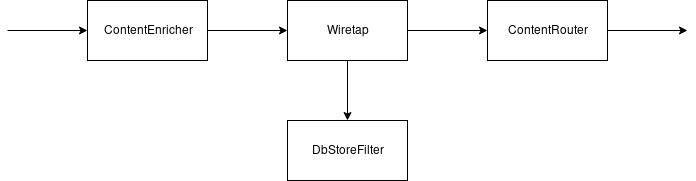

# MessageBroker
A simple message broker for "Distributed Applications Programming" course

Данный message broker состоит из двух частей:
1. Sender/Receiver, объединённые в одно Angular приложение;
2. REST-сервис, содержащий message broker.

Схема реализации message broker выглядит следующим образом:

## Message Channel (Канал сообщений)
Канал сообщений реализован в виде объектов класса `Channel`. Каждый объект данного класса имеет имя, позволяющее его идентифицировать, и очередь сообщений (на самом деле по очереди сообщений для каждого пользователя, но об этом далее). 

## Message Translator (Транслятор сообщений)
Клиентская и серверная части имеют собственные представления "сообщения" `News`. Также, для передачи новостей между клиентской и серверной частью используется формат JSON. Итого, в пределах приложения сообщения в разные моменты времени имеют 3 разные формы. Данные переходы осуществляются с помощью транслятора сообщений. В данном приложении, перевод сообщения из JS-объекта в JSON, а затем в объект C# происходит автоматически внутри браузера и внутри окружения ASP.NET Core. ASP.NET Core осуществляет данные трансформации с помощью аттрибутов `[Produces(MediaTypeNames.Application.Json)]` и `[FromBody]`. Первый аттрибут транформирует объекты, возвращаемые в контроллере, а второй -- тело запроса к `/stories` ресурсу.

## Publish-Subscribe Channel (Канал публикация-подписка)
Данный шаблон реализован в виде класса `Channel`. При подписке на определённый канал с помощью метода `Subscribe(clientId)`, создаётся объект типа `Pipe` внутри канала, который будет содержать очередь сообщений для определённого пользователя. Подписчики данного канала и те, кто в него пишет ничего не знают друг о друге, что и является преймуществом данного паттерна.

## Dead-Message Channel (Канал недоставленных сообщений)
Данный паттерн также реализован в виде класса `Channel`. Обеспечение доставки неполученных сообщений в данном приложении осуществляется следующим способом: при подписке на канал, новая очередь сообщения заполняется 5 последними новостями из БД. Поэтому новый подписчик канала имеет шанс получить новости, которые невозможно было бы получить иначе.

## Content-Based Router (Маршрутизатор на основе содержимого)
Маршрутизатор в данной реализации message broker реализован в виде объекта класса `StoryRouter`. Объект данного класса содержит словарь, где каждому используемому каналу ставится в соответствие его название. При обработке новости, `StoryRouter` смотрит в свойство `Tag` сообщения. В соответствии со значением данного свойства, `StoryRouter` отправляет сообщение в нужный канал.

## Content Enricher (Расширитель содержимого)
Расширение содержимого производится объектом `ContentEnricher`. Данный объект следит за значениями `Author` и `PublishedDate` новости. Если данные свойства пусты, то он заполняет их заданными значениями ("me" для `Author`, время модификации для `PublishedDate`).

## Wiretap (Отвод)
Отвод производится объектом класса `Wiretap`. Данный объект содержит две очереди: основную и очередь отвода. Основная очередь будет использоваться как вход для остальных объектов в конвеере message broker. Очередь отвода поставляет копии новостей объекту `DbStoreFilter`, который сохраняет полученные сообщения в MongoDB базу данных.
